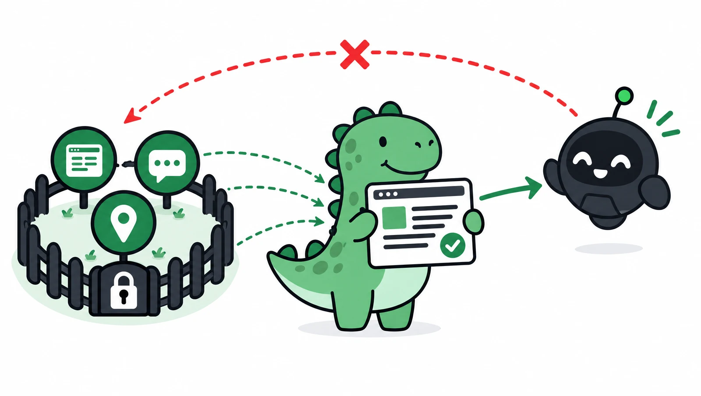

[AI 검색은 어떻게 우리 비즈니스를 소개할까](/guides/ai-search-basics/)에서 "AI가 읽어 갈 수 없는 곳에만 정보가 있으면 소개되기 어렵다"고 했습니다. 이 글은 그 이유와, 우리 비즈니스가 무엇을 확인하고 어떻게 하면 좋은지를 조금 더 자세히 설명합니다.

## robots.txt는 무엇인가요

웹사이트에는 검색엔진이나 AI 서비스의 **수집 프로그램**(크롤러, 봇이라고도 부릅니다)이 찾아와 페이지를 읽어 갑니다. robots.txt는 이 수집 프로그램들에게 "**여기는 들어와도 되고, 여기는 들어오지 말아 주세요**"라고 알려주는 안내문입니다.

- 웹사이트의 주소 뒤에 `/robots.txt`를 붙이면 누구나 볼 수 있습니다. 예: `https://우리주소/robots.txt`
- 법으로 강제되는 규칙은 아니고 **요청**입니다. 다만 주요 검색엔진과 AI 서비스 대부분은 공식적으로 이 안내문을 지킨다고 밝히고 있습니다.

robots.txt는 대략 이렇게 생겼습니다.

```text
User-agent: GPTBot
Disallow: /

User-agent: *
Allow: /
```

`User-agent`는 "어떤 수집 프로그램에게 하는 말인지", `Disallow: /`는 "사이트 전체에 들어오지 말라", `Allow: /`는 "들어와도 된다"는 뜻입니다. 위 예시는 "GPTBot은 들어오지 말고, 나머지는 모두 들어와도 된다"는 의미입니다.

## AI 서비스의 수집 프로그램은 어떻게 나뉘나요

AI 회사들은 수집 프로그램을 목적에 따라 나눠서 운영합니다. 이 구분이 중요합니다. **학습용을 막는 것과 검색용을 막는 것은 결과가 다르기 때문입니다.**

| 회사 | 학습용 | 검색·답변용 | 사용자가 요청할 때 |
|---|---|---|---|
| OpenAI (ChatGPT) | GPTBot | OAI-SearchBot | ChatGPT-User |
| Anthropic (Claude) | ClaudeBot | Claude-SearchBot | Claude-User |
| Perplexity | 학습용 수집 없음 | PerplexityBot | Perplexity-User |
| Google (Gemini, 구글 검색) | Google-Extended | Googlebot | — |

- **학습용**: AI 모델을 만들 때 쓸 자료를 모읍니다. 막으면 "우리 글을 AI 학습에 쓰지 말아 달라"는 뜻이 됩니다.
- **검색·답변용**: AI 검색에서 답을 만들고 출처를 보여 줄 때 쓸 페이지를 찾습니다. **AI 답변에 인용되고 싶다면 이쪽은 열어 두어야 합니다.**
- **사용자가 요청할 때**: 사용자가 대화 중에 특정 페이지를 열어 달라고 할 때 방문합니다. 각 회사는 사용자가 직접 요청한 방문이라 robots.txt가 적용되지 않을 수 있다고 안내합니다.

Google은 조금 다릅니다. Google-Extended는 별도의 수집 프로그램이 아니라, 구글이 수집한 내용을 Gemini 학습과 **Gemini가 답을 만들 때 근거로 쓰는 데** 사용해도 되는지 정하는 이름표입니다. 구글은 이 설정이 구글 검색 노출에는 영향을 주지 않는다고 안내합니다. 다만 막으면 Gemini 답변의 근거로 쓰이는 것도 막힐 수 있습니다.

수집 프로그램의 이름과 역할은 회사 사정에 따라 바뀔 수 있습니다. 이 표는 2026년 10월 각 회사의 공식 안내를 기준으로 정리했습니다.

## 왜 많은 플랫폼이 AI를 막을까요

2026년 10월 확인 기준으로 국내 플랫폼 업체(블로그, 카페, 지도) 상당수가 학습용뿐 아니라 검색·답변용 수집 프로그램까지 robots.txt로 막아 두고 있습니다. 플랫폼 입장에서는 그럴 만한 이유가 있습니다.

- 회원들이 올린 글이 허락 없이 AI 학습에 쓰이는 것을 막고 싶습니다.
- 사람들이 AI 답변만 보고 플랫폼에 들어오지 않으면 방문자와 광고 수익이 줄어듭니다.
- AI 회사와 콘텐츠 사용 조건을 따로 협의하려는 경우도 있습니다.

이건 플랫폼의 운영 정책이고, 좋고 나쁨의 문제가 아닙니다. 다만 **우리 비즈니스 정보가 그런 플랫폼에만 있다면**, AI 검색이 그 정보를 직접 읽어 가기 어렵다는 점은 알고 있어야 합니다.

## 우리 비즈니스는 무엇을 하면 될까요

### 1. 우리 웹페이지의 robots.txt를 확인합니다

홈페이지가 있다면 주소 뒤에 `/robots.txt`를 붙여 열어 보세요.

- 파일이 없다면: 특별히 막은 것이 없다는 뜻입니다. 대부분의 수집 프로그램이 들어올 수 있습니다.
- `User-agent: *` 아래에 `Disallow: /`가 있다면: 모든 수집 프로그램을 막고 있습니다. 검색엔진에도 잘 나오지 않을 수 있으니 바로 확인이 필요합니다.
- OAI-SearchBot, Claude-SearchBot, PerplexityBot 같은 이름 아래에 `Disallow: /`가 있다면: AI 검색에서 인용되기 어렵습니다.

### 2. 의도하지 않은 차단이 없는지 확인합니다

직접 설정하지 않았는데 막혀 있는 경우도 있습니다.

- 홈페이지 제작 업체가 만들 때 기본값으로 막아 두었을 수 있습니다.
- 일부 보안·호스팅 서비스에는 AI 수집 프로그램을 한 번에 막는 기능이 있어서, 모르는 사이에 켜져 있을 수 있습니다.

확인이 어렵다면 제작 업체나 관리 업체에 "AI 검색용 수집 프로그램이 막혀 있는지" 물어보세요.

### 3. 목적에 맞게 설정합니다

**AI 답변에 잘 인용되는 것이 목적이라면** 모두 열어 두는 것이 가장 단순합니다.

```text
User-agent: *
Allow: /
```

**학습에는 쓰이고 싶지 않지만 AI 검색에는 나오고 싶다면** 학습용만 막고 검색·답변용은 열어 둡니다.

```text
User-agent: GPTBot
Disallow: /

User-agent: ClaudeBot
Disallow: /

User-agent: *
Allow: /
```

이때 Google-Extended까지 막으면 Gemini가 답을 만들 때 근거로 쓰이는 것도 막힐 수 있으니, Gemini 답변에도 나오고 싶다면 열어 두는 것을 권합니다.

### 4. 플랫폼은 그대로, AI에게 열어 둔 공식 안내 페이지를 함께 둡니다



*플랫폼에 있는 정보는 AI가 바로 가져가기 어렵습니다. 흩어진 정보를 공식 안내 페이지에 모아 두면 AI가 그 페이지를 읽고 우리 비즈니스를 소개할 수 있습니다.*

플랫폼의 설정은 우리가 바꿀 수 없습니다. 그래서 플랫폼 채널은 그대로 운영하면서, 우리가 직접 관리하고 AI에게 열어 둔 공식 안내 페이지를 하나 두는 것이 현실적인 방법입니다. 이 페이지에 전문 분야, 지역, 비용 기준, 진행 절차를 정리하고, 운영 중인 플랫폼 채널을 함께 연결해 두면 AI가 우리 비즈니스를 이해할 수 있는 출처가 생깁니다.

robots.txt 말고도 점검할 것이 궁금하다면 [AI 검색(GEO) 준비도 체크리스트](/guides/ai-search-checklist/)를 함께 확인해 보세요.

## 참고한 공식 자료

이 글의 수집 프로그램 이름과 역할은 아래 공식 안내를 기준으로 정리했습니다 (2026년 10월 확인).

- robots.txt 표준: [RFC 9309 Robots Exclusion Protocol](https://www.rfc-editor.org/rfc/rfc9309.html)
- Google: [robots.txt 소개](https://developers.google.com/search/docs/crawling-indexing/robots/intro), [Google 크롤러와 Google-Extended](https://developers.google.com/crawling/docs/crawlers-fetchers/google-common-crawlers)
- OpenAI: [OpenAI 수집 프로그램 안내 (GPTBot, OAI-SearchBot, ChatGPT-User)](https://developers.openai.com/api/docs/bots)
- Anthropic: [Anthropic 수집 프로그램 안내 (ClaudeBot, Claude-SearchBot, Claude-User)](https://support.claude.com/en/articles/8896518-does-anthropic-crawl-data-from-the-web-and-how-can-site-owners-block-the-crawler)
- Perplexity: [Perplexity 수집 프로그램 안내 (PerplexityBot, Perplexity-User)](https://docs.perplexity.ai/docs/resources/perplexity-crawlers)
